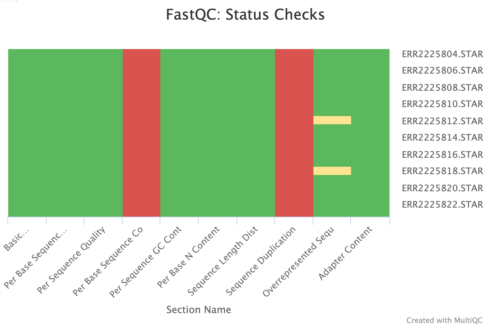

```{r setup, include=FALSE}
knitr::opts_chunk$set(echo = TRUE, eval=FALSE, message=FALSE, warning=FALSE)
```

# Downloading & documenting the data

For this project, I will be analyzing the "BATLAS" dataset. This dataset has been fully uploaded to ENA with accession number `ERP022805`. Further information about the data can be found [here](https://www.ebi.ac.uk/ena/browser/view/ERP022805). To download the manifest of this study, we can use the following command:

```{bash }
wget -O ERP022805_read_run.tsv 'https://www.ebi.ac.uk/ena/portal/api/filereport?accession=ERP022805&result=read_run&fields=study_accession,sample_accession,secondary_sample_accession,experiment_accession,run_accession,scientific_name,experiment_title,fastq_ftp,sample_alias&format=tsv&download=true&limit=0'
```

Now, we can use a `while` loop to download all of the samples that have a `sample_alias` that starts with `E387`, since those are the ones we are interested in. To do this, we can pipe the output of the `awk` function (the ftp downlad links at column `$8`) into a `while` loop that uses `read` to store the download links into a variable `path`. Then, for each `path`, build the dowlonad url adding "ftp://" and run `wget`:

```{bash}
awk -F'\t' 'NR>1 && $9 ~ /^E387/ {print $8}' ERP022805_read_run.tsv |
while read -r path; do
  url="ftp://$path"
  echo "======= Starting download of $url"
  wget -c "$url"
done
```

For convenience, we can generate a `tsv` file that contains all of the information we might find useful for downstream analysis and differential gene expression analysis. To do this, we can use the following command. We first parse the first row (headers, `NR==1`) and store the column index of `sample_alias` and `run_accession`.

We then print the column names of the new file, and parse the stored variables to print the corresponding fields in each of the previously defined columns

```{bash}
awk -F'\t' '
BEGIN{OFS="\t"}
NR==1{ for (i=1;i<=NF;i++) {
    if ($i=="sample_alias") sa=i
    if ($i=="run_accession") ra=i}
  print "run_accession","sample_alias","sample_number","fat_type" 
  next
}
sa && ra && $sa ~ /^E387_/{
  split($sa,a,"_")
  fat=a[3] "_" a[4]
  print $ra, $sa, a[2], fat}' \
  ERP022805_read_run.tsv > sample_table.tsv
```

## Original Publication

Perdikari A, Leparc GG, Balaz M, Pires ND, Lidell ME, Sun W, Fernandez-Albert F, Müller S, Akchiche N, Dong H, Balazova L, Opitz L, Röder E, Klein H, Stefanicka P, Varga L, Nuutila P, Virtanen KA, Niemi T, Taittonen M, Rudofsky G, Ukropec J, Enerbäck S, Stupka E, Neubauer H, Wolfrum C. **BATLAS: Deconvoluting Brown Adipose Tissue.** *Cell Reports.* 2018 Oct 16;25(3):784–797.e4

## Who generated the data

The BATLAS RNA-seq data (ENA study ERP022805) were generated by the BATLAS study team (referenced above). The main contributor was Christian Wolfrum’s group at the Institute of Food, Nutrition and Health, ETH Zürich.

Deep neck (brown adipose tissue, BAT) and adjacent white subcutaneous adipose tissue (WAT) samples were obtained from the lower third of the neck by an experienced ENT surgeon from 18 individuals (1 Male/ 17 Female) during neck surgery under general anesthesia, age between 22 to 73 years old and BMI between 19 to 34 kg/m2. The deep neck adipose tissue sample was taken from pre- and paravertebral space between the common carotid and trachea in case of thyroid surgery and just laterally to the carotid sheath in case of branchial cleft cyst surgery. 

In all cases, the surgical approach was sufficient to reach and sample the deep neck adipose tissue without any additional morbidity. Patients with malignant disease and subjects younger than 18 years were excluded from participation in the study. Adipose tissue samples were immediately cleaned from blood and connective tissue, and frozen in liquid nitrogen until further processing. The clinical study on obese subjects (20/42 Male/Female; age 40.5 ± 1.6 years; BMI 41.2 ± 0.9 kg/m2) undergoing caloric restriction with a daily intake of 800 kcal was approved by the ethics committee at the Uni- versity Hospital of Heidelberg, Germany (S-365/2007). It conforms to the ethical guidelines of the 2000 Helsinki declaration. All participants provided witnessed written informed consent prior to entering the study. The study was registered as NCT00773565.

## How was the RNA extracted?

Total RNA was extracted from whole adipose tissues using Trizol reagent (Invitrogen) according to the manufacturer’s instructions.

## What library prep was used?

Deep neck BAT and subcutaneous white adipose tissue WAT RNA-Seq libraries were prepared using 25 ng of total RNA input with the TrueSeq RNA Sample Prep Kit v2 (Illumina) producing an average 275 bp fragment including adapters. 

## How was mRNA enriched?

According to the TrueSeq RNA Sample Prep Kit v2 (Illumina) user manual, the messenger RNA is first purified using polyA selection, then chemically fragmented and converted into single-stranded cDNA using random hexamer priming.

## What cell type or tissue was used?

Brown adipose tissue (BAT) and white adipose tissue (WAT) from human deep neck surgeries

## What was the treatment/experimental condition?

The experimental condition would be Brown adipose tissue (BAT). We want to know what genes are differentially expressed in BAT vs WAT.

## What sequencing platform was used?

In the final step before RNA-Seq, eight individual libraries were normalized and pooled together using the adaptor indices supplied by the manufacturer. RNA-Seq was performed as 50 bp, single reads and 7 bases index read on an Illumina HiSeq2000 instrument. Approximately 20–30 million reads per sample were obtained.

## Citations

Orava, J., Nuutila, P., Lidell, M.E., Oikonen, V., Noponen, T., Viljanen, T., Scheinin, M., Taittonen, M., Niemi, T., Enerba ¨ ck, S., and Virtanen, K.A. (2011). Different metabolic responses of human brown adipose tissue to activation by cold and insulin. Cell Metab. 14, 272–279.


# Align the FASTQ file with an appropriate aligner

## Alignment

For aligning the data, I will first build an STAR index. Since the final objective of this small project is to merge the resulting transcript abundances with the GTEx data, I will use the same genome build and GENECODE version as [GTEx](https://www.gtexportal.org/home/releaseInfoPage).

First, lets download the genome annotation and the FASTA:

```{bash}
wget https://ftp.ebi.ac.uk/pub/databases/gencode/Gencode_human/release_39/gencode.v39.annotation.gtf.gz
gunzip -c gencode.v39.annotation.gtf.gz > gencode.v39.annotation.gtf

wget https://ftp.ebi.ac.uk/pub/databases/gencode/Gencode_human/release_39/GRCh38.primary_assembly.genome.fa.gz
gunzip GRCh38.primary_assembly.genome.fa.gz
``` 

To create the STAR index and align the samples, we can use the following script and `sbatch`. On note, GTEx uses STAR version `2.7.10a` while our `angsd` environment uses `2.7.11a`. Ideally, we would like to use the same version to maximize cross-dataset comparability; but I will be using this environment to keep things more reproducible.

I will ask the slurm manager for 8 cpus per task so things more a little faster `{SLURM_CPUS_PER_TASK:-1}`. This will fall back to 1 if the variable is missing for any reason.

`STAR_index_and_alignment.sh`:
```{bash}
#!/usr/bin/env bash
#SBATCH --job-name=star_hg38_v39
#SBATCH --output=/athena/angsd/scratch/sdb4002/Final_project/STAR_RUN.out
#SBATCH --error=/athena/angsd/scratch/sdb4002/Final_project/STAR_RUN.err
#SBATCH --time=24:00:00
#SBATCH --cpus-per-task=8
#SBATCH --mem=64G

set -euo pipefail

# User-configurable paths

PROJECT_DIR="/athena/angsd/scratch/sdb4002/Final_project"
INDEX_DIR="${PROJECT_DIR}/STAR_index_GENCODE_v39"
FASTQ_DIR="${PROJECT_DIR}/FASTQ"
BAM_DIR="${PROJECT_DIR}/BAMs"

# Fasta and GTF 
GENOME_FA="/athena/angsd/scratch/sdb4002/Final_project/GRCh38.primary_assembly.genome.fa"
GTF_FILE="/athena/angsd/scratch/sdb4002/Final_project/gencode.v39.annotation.gtf"

# Since fastq files are 52bp
SJDB_OVERHANG=49

# Environment
source /home/fs01/sdb4002/miniconda3/etc/profile.d/conda.sh
conda activate angsd

# Build STAR index using downloaded reference and FASTA (GENCODE v39, GRCh38/hg38)
mkdir -p "${INDEX_DIR}"
mkdir -p "${BAM_DIR}"

if [[ -s "${INDEX_DIR}/Genome" && -s "${INDEX_DIR}/SA" && -s "${INDEX_DIR}/SAindex" ]]; then # check if the index already exist...
  echo "STAR index already exists in ${INDEX_DIR}; skipping Index creation."
else
  echo "STAR index not found (or incomplete); generating in ${INDEX_DIR}..."
  STAR \
    --runMode genomeGenerate \
    --runThreadN "${SLURM_CPUS_PER_TASK:-1}" \
    --genomeDir "${INDEX_DIR}" \
    --genomeFastaFiles "${GENOME_FA}" \
    --sjdbGTFfile "${GTF_FILE}" \
    --sjdbOverhang "${SJDB_OVERHANG}"

# Align each FASTQ in FASTQ directory and write BAMs to BAM directory
shopt -s nullglob # so it does not crash if FASTQs are not found
FASTQS=("${FASTQ_DIR}"/*.fastq.gz)
(( ${#FASTQS[@]} > 0 )) || { echo "No FASTQs found in ${FASTQ_DIR}" >&2; exit 1; }

for fastq in "${FASTQS[@]}"; do
  sample="$(basename "${fastq}" .fastq.gz)"
  prefix="${BAM_DIR}/${sample}.STAR."

  STAR \
    --runMode alignReads \
    --runThreadN "${SLURM_CPUS_PER_TASK:-1}" \
    --genomeDir "${INDEX_DIR}" \
    --readFilesIn "${fastq}" \
    --readFilesCommand zcat \
    --outFileNamePrefix "${prefix}" \
    --outSAMattributes All \
    --outSAMtype BAM SortedByCoordinate

  samtools index "${prefix}Aligned.sortedByCoord.out.bam"
done
```

For this run, I used mostly the default STAR parameters. I used `--sjdbOverhang 49` so splice junction sequences are optimized for the read length when creating the INDEX

When running the alignment, I specified `outSAMattributes All` to get all of the attributes, and `--outSAMtype BAM SortedByCoordinate` so the outputs would be sorted and `BAM` instead of `SAM`. Then, I also indexed each `BAM` right after running STAR.

## FastQC

For FastQC and MultiQC, we can run on a `srun` on the terminal:

```{bash}
mkdir FASTQC_BAM && mkdir MULTIQC_BAM

BAMS=(/athena/angsd/scratch/sdb4002/Final_project/BAMs/*.bam)

for bam in "${BAMS[@]}"; do
  fastqc -o "/athena/angsd/scratch/sdb4002/Final_project/FASTQC_BAM" "${bam}"
done
```
```{bash }
conda activate multiqc
multiqc "/athena/angsd/scratch/sdb4002/Final_project/FASTQC_BAM" \
  -o "/athena/angsd/scratch/sdb4002/Final_project/MULTIQC_BAM" \
  -n multiqc_bam_fastqc_report
```

Looking at the FASTQC results, I see that all samples fail `Per base sequence content` but there are no overrepresented sequences or adapter contamination. This could be caused by random hexamer priming bias (the “random” primers aren’t perfectly random).

The analysis also fails `Sequence duplication levels`, with only around 20% of the reads remaining if the samples were to be deduplicated. Since FASTQ cannot tell PCR duplicates from “real” duplicates of abundant transcripts because it looks at raw sequences only.

```{R}

```

Otherise, the QC analysis looks okay. I will check what sequences are overrepresented to have an idea of what is driving these sequence duplication observations

```{bash}
zcat ERR2225804.fastq.gz | awk 'NR%4==2' | sort | uniq -c | sort -nr | head -20
```
```{}
  10819 CTTGGATTAAGGCGACAGCGATTTCTAGGATAGTCAGTAGAATTAGAATTGT
   8956 CCCGTATCGAAGGCCTTTTTGGACAGGTGGTGTGTGGTGGCCTTGGTATGTG
   8925 CCGTCATCTACTCTACCATCTTTGCAGGCACACTCATCACAGCGCTAAGCTC
   7545 CAAGACGCTACTTCCCCTATCATAGAAGAGCTTATCACCTTTCATGATCACG
   7373 CCAAAATGAACGAAAATCTGTTCGCTTCATTCATTGCCCCCACAATCCTAGG
   7019 CCCAAACCCACTCCACCTTACTACCAGACAACCTTAGCCAAACCATTTACCC
   6737 CTAGCATTTACCATCTCACTTCTAGGAATACTAGTATATCGCTCACACCTCA
   6417 CACATGCCTATCATATAGTAAAACCCAGCCCATGACCCCTAACAGGGGCCCT
   6337 GTTTGGTCTAGGGTGTAGCCTGAGAATAGGGGAAATCAGTGAATGAAGCCTC
   6213 GTCGTGTAGTACGATGTCTAGTGATGAGTTTGCTAATACAATGCCAGTCAGG
   6189 CTCAAATCATGAAAATTATTAATATTACTGCTGTTAGAGAAATGAATGAGCC
   6039 CCAAAATCCATTTCACTATCATATTCATCGGCGTAAATCTAACTTTCTTCCC
   5814 GTGGAAGTGAGCTACAACGTAGTACGTGTCGTGTAGTACGATGTCTAGTGAT
   5582 CTAAATACTACCGTATGGCCCACCATAATTACCCCCATACTCCTTACACTAT
   5263 GTAAAACCCAGCCCATGACCCCTAACAGGGGCCCTCTCAGCCCTCCTAATGA
   5161 CTGAGATGTTAGTATTAGTTAGTTTTGTTGTGAGTGTTAGGAAAAGGGCATA
   5101 GTTTGATTAGTCATTGTTGGGTGGTGATTAGTCGGTTGTTGATGAGATATTT
   5032 CTGGCATTGTATTAGCAAACTCATCACTAGACATCGTACTACACGACACGTA
   5017 CTGCTGTTAGAGAAATGAATGAGCCTACAGATGATAGGATGTTTCATGTGGT
   5016 AAATGAATGAGCCTACAGATGATAGGATGTTTCATGTGGTGTATGCATCGGG
```

Upon conducting a BLAST search, most of these highly duplicated sequences come from mitochondrial genes. BAT is a tissue highly enriched in mitocondria, so it is no surprising to find this type of enrichment. However, WAT should not be as enriched. To check this, we will check the percentage of reads aligning to the mitochondrion `chrM`:

```{bash}
for bam in *.bam; do
  printf "%s\t" "$bam"
  samtools idxstats "$bam" | awk 'BEGIN{mt=0; tot=0}
         {tot += $3}
         ($1=="MT" || $1=="chrM") {mt = $3}
         END {
           if (tot==0) {printf("MT reads: %d / %d (NA)\n", mt, tot); exit}
           printf("MT reads: %d / %d (%.2f%%)\n", mt, tot, 100*mt/tot)
         }'
done
```

```{}
ERR2225804.STAR.Aligned.sortedByCoord.out.bam   MT reads: 7076507 / 32789062 (21.58%)
ERR2225805.STAR.Aligned.sortedByCoord.out.bam   MT reads: 4870472 / 28969581 (16.81%)
ERR2225806.STAR.Aligned.sortedByCoord.out.bam   MT reads: 4038709 / 32059933 (12.60%)
ERR2225807.STAR.Aligned.sortedByCoord.out.bam   MT reads: 4838939 / 32202031 (15.03%)
ERR2225808.STAR.Aligned.sortedByCoord.out.bam   MT reads: 10036141 / 30709186 (32.68%)
ERR2225809.STAR.Aligned.sortedByCoord.out.bam   MT reads: 4447025 / 36458272 (12.20%)
ERR2225810.STAR.Aligned.sortedByCoord.out.bam   MT reads: 7328692 / 32043409 (22.87%)
ERR2225811.STAR.Aligned.sortedByCoord.out.bam   MT reads: 4280930 / 31122168 (13.76%)
ERR2225812.STAR.Aligned.sortedByCoord.out.bam   MT reads: 16945371 / 31865569 (53.18%)
ERR2225813.STAR.Aligned.sortedByCoord.out.bam   MT reads: 5330467 / 33934060 (15.71%)
ERR2225814.STAR.Aligned.sortedByCoord.out.bam   MT reads: 8937631 / 30847538 (28.97%)
ERR2225815.STAR.Aligned.sortedByCoord.out.bam   MT reads: 5046633 / 28589238 (17.65%)
ERR2225816.STAR.Aligned.sortedByCoord.out.bam   MT reads: 11707747 / 37042422 (31.61%)
ERR2225817.STAR.Aligned.sortedByCoord.out.bam   MT reads: 5155179 / 30675231 (16.81%)
ERR2225818.STAR.Aligned.sortedByCoord.out.bam   MT reads: 8408498 / 28732392 (29.26%)
ERR2225819.STAR.Aligned.sortedByCoord.out.bam   MT reads: 2909748 / 30491456 (9.54%)
ERR2225820.STAR.Aligned.sortedByCoord.out.bam   MT reads: 7829343 / 32235658 (24.29%)
ERR2225821.STAR.Aligned.sortedByCoord.out.bam   MT reads: 4269606 / 31373385 (13.61%)
ERR2225822.STAR.Aligned.sortedByCoord.out.bam   MT reads: 4777305 / 30491358 (15.67%)
```

We can calculate the average percentage of reads that map to `chrM` across the two different sample groups that we are studying:

BAT (brownv fat, n=10): 27.27% 

WAT (white fat, n=10): 14.08%

## Gene-level quantification with featureCounts

After alignment, the next step is to summarize reads to genes and build a raw counts matrix for downstream differential expression analysis. For this, we can use `featureCounts` from the Subread package on the coordinate-sorted BAM files produced by STAR. Because these data are single-end, we do not use paired-end options. We count reads overlapping `exon` features and summarize them at the `gene_id` level using the same GENCODE v39 annotation that was used for alignment.

`Feature_counts.sh`:
```{bash}
#!/usr/bin/env bash
#SBATCH --job-name=featurecounts_batlas
#SBATCH --output=/athena/angsd/scratch/sdb4002/Final_project/featureCounts.out
#SBATCH --error=/athena/angsd/scratch/sdb4002/Final_project/featureCounts.err
#SBATCH --time=08:00:00
#SBATCH --cpus-per-task=8
#SBATCH --mem=32G

set -euo pipefail
shopt -s nullglob

PROJECT_DIR="/athena/angsd/scratch/sdb4002/Final_project"
BAM_DIR="${PROJECT_DIR}/BAMs"
COUNTS_DIR="${PROJECT_DIR}/counts"
GTF_FILE="${PROJECT_DIR}/gencode.v39.annotation.gtf"

source /home/fs01/sdb4002/miniconda3/etc/profile.d/conda.sh
conda activate angsd

mkdir -p "${COUNTS_DIR}"

BAMS=("${BAM_DIR}"/*.bam)
(( ${#BAMS[@]} > 0 )) || { echo "No BAM files found in ${BAM_DIR}" >&2; exit 1; }

featureCounts \
  -T "${SLURM_CPUS_PER_TASK:-1}" \
  -a "${GTF_FILE}" \
  -o "${COUNTS_DIR}/BATLAS_featureCounts.txt" \
  -t exon \
  -g gene_id \
  "${BAMS[@]}"
```

```{}

        ==========     _____ _    _ ____  _____  ______          _____  
        =====         / ____| |  | |  _ \|  __ \|  ____|   /\   |  __ \ 
          =====      | (___ | |  | | |_) | |__) | |__     /  \  | |  | |
            ====      \___ \| |  | |  _ <|  _  /|  __|   / /\ \ | |  | |
              ====    ____) | |__| | |_) | | \ \| |____ / ____ \| |__| |
        ==========   |_____/ \____/|____/|_|  \_\______/_/    \_\_____/
          v2.0.6

//========================== featureCounts setting ===========================\\
||                                                                            ||
||             Input files : 21 BAM files                                     ||
||                                                                            ||
||                           ERR2225804.STAR.Aligned.sortedByCoord.out.bam    ||
||                           ERR2225805.STAR.Aligned.sortedByCoord.out.bam    ||
||                           ERR2225806.STAR.Aligned.sortedByCoord.out.bam    ||
||                           ERR2225807.STAR.Aligned.sortedByCoord.out.bam    ||
||                           ERR2225808.STAR.Aligned.sortedByCoord.out.bam    ||
||                           ERR2225809.STAR.Aligned.sortedByCoord.out.bam    ||
||                           ERR2225810.STAR.Aligned.sortedByCoord.out.bam    ||
||                           ERR2225811.STAR.Aligned.sortedByCoord.out.bam    ||
||                           ERR2225812.STAR.Aligned.sortedByCoord.out.bam    ||
||                           ERR2225813.STAR.Aligned.sortedByCoord.out.bam    ||
||                           ERR2225814.STAR.Aligned.sortedByCoord.out.bam    ||
||                           ERR2225815.STAR.Aligned.sortedByCoord.out.bam    ||
||                           ERR2225816.STAR.Aligned.sortedByCoord.out.bam    ||
||                           ERR2225817.STAR.Aligned.sortedByCoord.out.bam    ||
||                           ERR2225818.STAR.Aligned.sortedByCoord.out.bam    ||
||                           ERR2225819.STAR.Aligned.sortedByCoord.out.bam    ||
||                           ERR2225820.STAR.Aligned.sortedByCoord.out.bam    ||
||                           ERR2225821.STAR.Aligned.sortedByCoord.out.bam    ||
||                           ERR2225822.STAR.Aligned.sortedByCoord.out.bam    ||
||                           ERR2225823.STAR.Aligned.sortedByCoord.out.bam    ||
||                                                                            ||
||             Output file : BATLAS_featureCounts.txt                         ||
||                 Summary : BATLAS_featureCounts.txt.summary                 ||
||              Paired-end : no                                               ||
||        Count read pairs : no                                               ||
||              Annotation : gencode.v39.annotation.gtf (GTF)                 ||
||      Dir for temp files : /athena/angsd/scratch/sdb4002/Final_project/ ... ||
||                                                                            ||
||                 Threads : 1                                                ||
||                   Level : meta-feature level                               ||
||      Multimapping reads : not counted                                      ||
|| Multi-overlapping reads : not counted                                      ||
||   Min overlapping bases : 1                                                ||
||                                                                            ||
\\============================================================================//

//================================= Running ==================================\\
||                                                                            ||
|| Load annotation file gencode.v39.annotation.gtf ...                        ||
||    Features : 1552754                                                      ||
||    Meta-features : 61533                                                   ||
||    Chromosomes/contigs : 25                                                ||
||                                                                            ||
|| Process BAM file ERR2225804.STAR.Aligned.sortedByCoord.out.bam...          ||
```

The `featureCounts` output includes annotation columns followed by one column per BAM file. To generate a cleaner gene-by-sample counts matrix, we can keep only the gene identifier and sample count columns, while changing the sample names to the `sample_alias` from our `sample_table.tsv` for better readability. We can do this with the following `awk` command:

```{bash}
awk 'BEGIN{FS=OFS="\t"}
FNR==NR {
  if (FNR > 1) alias[$1] = $2 # store sample_alias by run_accession from sample_table
  next
}
/^#/ {next}
$1 == "Geneid" && !seen_header {
  printf "Geneid"
  for (i=7; i<=NF; i++) {
    sample = $i # get the sample name from the header
    sub(/^.*\//, "", sample) # strip path
    sub(/\.STAR\.Aligned\.sortedByCoord\.out\.bam$/, "", sample) # strip STAR suffix
    printf OFS alias[sample] # replace with sample_alias
  }
  printf "\n"
  seen_header = 1
  next
}
$1 != "Geneid" { # for data rows, keep geneid and counts
  printf $1 # "Geneid"
  for (i=7; i<=NF; i++) printf OFS $i # 
  printf "\n"
}' /athena/angsd/scratch/sdb4002/Final_project/sample_table.tsv \
   /athena/angsd/scratch/sdb4002/Final_project/counts/BATLAS_featureCounts.txt \
   > /athena/angsd/scratch/sdb4002/Final_project/counts/BATLAS_counts_matrix.tsv
```

This `BATLAS_counts_matrix.tsv` file contains raw gene counts, with genes in rows and samples in columns, and can be used directly as input for tools such as `DESeq2` or `edgeR`.

## DESeq2 analysis of BAT vs WAT differential expression

Following the workflow from the practical, we first import the raw count matrix, generate the sample metadata table, and build a `DESeqDataSet`. At this stage, the objective is to prepare and normalize the count data appropriately before carrying out the actual statistical testing for differential expression.

```{r, eval=TRUE}
library(DESeq2)
library(ggplot2)
library(magrittr)

RawCounts <- read.table("BATLAS_counts_matrix.tsv", header = TRUE, sep = "\t", check.names = FALSE)
SampleTable <- read.table("sample_table.tsv", header = TRUE, sep = "\t", stringsAsFactors = FALSE)

row.names(RawCounts) <- make.names(RawCounts$Geneid, unique = TRUE)
RawCounts <- as.matrix(RawCounts[, -1])

SampleTable$condition <- ifelse(grepl("^brown", SampleTable$fat_type, ignore.case = TRUE), "BAT", "WAT")
SampleTable <- SampleTable[, c("run_accession", "sample_alias", "sample_number", "fat_type", "condition")]
row.names(SampleTable) <- SampleTable$sample_alias

SampleTable <- SampleTable[colnames(RawCounts), , drop = FALSE]
SampleTable$condition <- factor(SampleTable$condition, levels = c("WAT", "BAT"))

dds_batlas <- DESeqDataSetFromMatrix(
  countData = RawCounts,
  colData = SampleTable,
  design = ~ condition)

dds_batlas
```

Because our simplified count matrix only contains the gene identifiers, I will store those identifiers as `rowData` so the `DESeqDataSet` still keeps the feature metadata in a structured way.

```{r, eval=TRUE}
head(counts(dds_batlas), n=2)
```

```{r, eval=TRUE}
as.data.frame(colData(dds_batlas))
```

As in the practical, it is useful to inspect the library sizes and remove genes with zero counts across all samples before normalization.

```{r, eval=TRUE}
colSums(counts(dds_batlas)) %>% barplot(
  las = 2,
  main = "Library sizes - Total reads assigned to genes")
```

```{r, eval=TRUE}
keep_genes <- rowSums(counts(dds_batlas)) > 0 # keep only those that have expression
dds_batlas <- dds_batlas[keep_genes, ]

dim(dds_batlas)
```

Next, we estimate DESeq2 size factors to account for differences in sequencing depth and RNA composition across samples. This gives us normalized counts that are more comparable across BAT and WAT.

```{r, eval=TRUE}
dds_batlas <- estimateSizeFactors(dds_batlas)

plot(
  sizeFactors(dds_batlas),
  colSums(counts(dds_batlas)),
  xlab = "Size factors",
  ylab = "Library sizes",
  cex = 0.8, # make points smaller for better visibility
  pch = 19) # solid points

counts_sf_normalized <- counts(dds_batlas, normalized = TRUE)
```

Compare the distributions of raw and normalized counts on the log scale:

```{r, eval=TRUE, fig.width=10, fig.height=6}
par(mfrow = c(1, 2))

boxplot(
  log2(counts(dds_batlas) + 1),
  notch = TRUE,
  main = "Non-normalized read counts",
  ylab = "log2(read counts)",
  cex = 0.6,
  las = 2)

boxplot(
  log2(counts(dds_batlas, normalized = TRUE) + 1),
  notch = TRUE,
  main = "Size-factor-normalized read counts",
  ylab = "log2(read counts)",
  cex = 0.6,
  las = 2)
```

To stabilize the variance for exploratory analyses such as clustering or PCA (heterskedacity violate underlaying assumptions), we can use the `rlog` transformation.

```{r, eval=TRUE}
assay(dds_batlas, "log_counts") <- log2(counts(dds_batlas, normalized = FALSE) + 1)
assay(dds_batlas, "log_norm_counts") <- log2(counts(dds_batlas, normalized = TRUE) + 1)

dst_rlog <- rlog(dds_batlas, blind = TRUE)
rlog_norm_counts <- assay(dst_rlog)

par(mfrow = c(1, 2))
plot(
  assay(dds_batlas, "log_norm_counts")[, 1:2],
  cex = 0.1,
  main = "log2 normalized counts")

plot(
  assay(dst_rlog)[, 1:2],
  cex = 0.1,
  main = "rlog transformed",
  xlab = colnames(assay(dst_rlog[, 1])),
  ylab = colnames(assay(dst_rlog[, 2])))
```

Using the variance-stabilized `rlog` values, we can now run a PCA to visualize the main axes of variation across samples and assess whether BAT and WAT separate globally.

```{r, eval=TRUE}
pca_data <- plotPCA(dst_rlog, intgroup = "condition", returnData = TRUE, ntop=500)
percent_var <- round(100 * attr(pca_data, "percentVar"))

ggplot(pca_data, aes(PC1, PC2, color = condition, label = name)) +
  geom_point(size = 3) +
  geom_text(vjust = -0.8, size = 3) +
  xlab(paste0("PC1: ", percent_var[1], "% variance")) +
  ylab(paste0("PC2: ", percent_var[2], "% variance")) +
  ggtitle("PCA of rlog-transformed counts") +
  theme_bw()
```

This shows that `E387_7_brown_fat` is relatively similar to the `WAT` samples. Since this are human samples taken surgically from patients and Brown adipose tissue is difficult to identify in adult humans, perhaps this sample has a higher proportion of white adipose tissue in it.

Finally, we can run the standard DESeq2 differential expression workflow comparing BAT against WAT and extract the results table.

```{r, eval=TRUE}
dds_batlas <- DESeq(dds_batlas)
res_bat_vs_wat <- results(dds_batlas, contrast = c("condition", "BAT", "WAT"))
res_bat_vs_wat <- res_bat_vs_wat[order(res_bat_vs_wat$padj), ]

head(as.data.frame(res_bat_vs_wat))
```

```{r, eval=TRUE}
summary(res_bat_vs_wat)
```

Lets visualize the results! First, for readability, I am going to change `EnsemblID` to `Symbols`

```{r, eval=TRUE}
library(biomaRt)

Vulcano <- as.data.frame(res_bat_vs_wat)
Vulcano$ensembl_gene_id <- sub("\\..*$", "", rownames(Vulcano))

mart <- useEnsembl(biomart = "genes", dataset = "hsapiens_gene_ensembl")

gene_map <- getBM(
  attributes = c("ensembl_gene_id", "hgnc_symbol"),
  filters = "ensembl_gene_id",
  values = unique(Vulcano$ensembl_gene_id),
  mart = mart)

gene_map <- gene_map[gene_map$hgnc_symbol != "", ]
gene_map <- gene_map[!duplicated(gene_map$ensembl_gene_id), ]

Vulcano <- merge(Vulcano, gene_map, by = "ensembl_gene_id", all.x = TRUE, sort = FALSE)
Vulcano$label <- ifelse(is.na(Vulcano$hgnc_symbol) | Vulcano$hgnc_symbol == "", rownames(as.data.frame(res_bat_vs_wat)), Vulcano$hgnc_symbol)
Vulcano <- Vulcano[match(sub("\\..*$", "", rownames(as.data.frame(res_bat_vs_wat))), Vulcano$ensembl_gene_id), ]
Vulcano$Gene <- rownames(as.data.frame(res_bat_vs_wat))
```

```{r, eval=TRUE ,fig.width=10, fig.height=8}
library(EnhancedVolcano)

EnhancedVolcano(
  Vulcano,
  lab = Vulcano$label,
  x = "log2FoldChange",
  y = "padj",
  pCutoff = 0.05,
  FCcutoff = 0.5,
  title = "BAT vs WAT differential expression",
  subtitle = "DESeq2 results",
  caption = "Adjusted P = BH FDR",
  col = c("grey80", "steelblue3", "goldenrod2", "coral"))
```

```{r, eval=TRUE}
sessionInfo()
```
